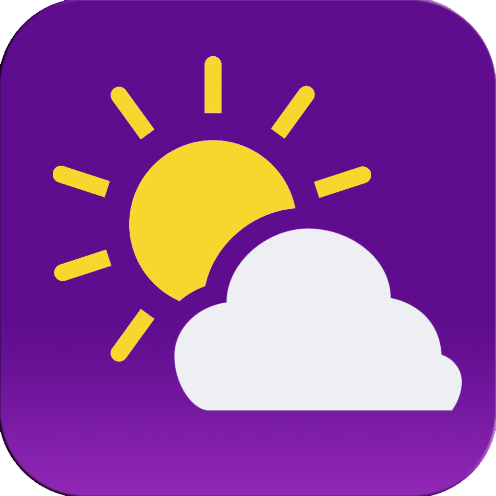

<h1> Weather Forecast App</h1>

A weather app that allows users to get the forecast by entering a city name or using the `Use Current Location` button.
<br>
Built using TypeScript and styled with SCSS.
<br>
It provides information on temperature, wind speed, humidity, and more.
<br>
The app offers a 5-day forecast for the entered city. 


<br>

## Features

- Search for weather forecasts of any city.
- Real-time weather details for the current location.
- Get temperature, wind speed, humidity, and more.
- 5-day forecast for the entered city.
- User-friendly interface with a responsive design.


<br>


## Technologies Used

- TypeScript
- SCSS
- Fetch API


<br>

## Installation

Follow the steps below to run the Snake Game project:

1. Download or clone the project from the GitHub repository:
   ```
   git clone https://github.com/eng-mohammad-mousa/Weather_App.git
   ```
2. Navigate to the project directory.

3. Open the `index.html` file in your preferred web browser. You can do this by double-clicking on the `index.html` file or right-clicking and selecting "Open With" your desired web browser.

Now you should be able to access weather information by following these installation steps. Enjoy staying informed about the weather!

<br>

## Contributing

Contributions are welcome! If you have any ideas, suggestions, or bug reports, please open an issue on the GitHub repository.

